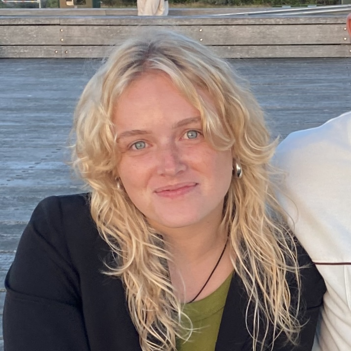

# MVC Kurs

## Beskrivning

Detta repo innehåller koden för en webbplats utvecklad som en del av en kurs om MVC-tekniker. Webbplatsen innehåller olika sidor, inklusive en "Om" sida, en "Hem" sida och en sida som genererar ett slumpmässigt "magiskt nummer".

## Installation

För att köra projektet lokalt, följ dessa steg:

1. Klona repot: git clone https://github.com/alicebergdahl/mvc-git.git

2. Navigera: cd mvc-course/symfony/app

3. Starta servern: php -S localhost:8889 -t public

4. Öppna webbläsaren: http://localhost:8889/